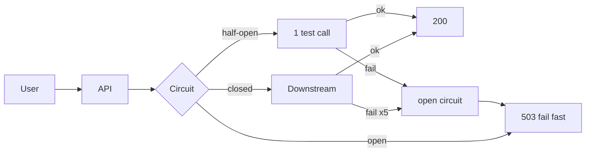

# Circuit Breaker — Request Flow

Export: [mermaid.live](https://mermaid.live) → Export PNG

```mermaid
flowchart LR
  User[User] --> API[API]
  API --> CB{Circuit}

  CB -->|closed| DS[Downstream]
  CB -->|open| Reject[503 fail fast]
  CB -->|half-open| Probe[1 test call]

  DS -->|ok| OK[200]
  DS -->|fail x5| Open[open circuit]
  Probe -->|ok| OK
  Probe -->|fail| Open
  Open --> Reject
```
